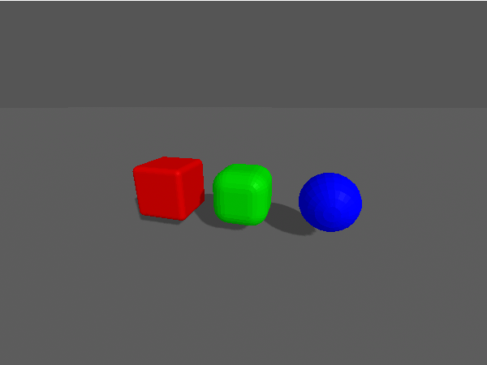

# aframe-rounded-box-component #

an A-Frame component and primitive for boxes with rounded edges

Boxes with sharp edges are already part of A-Frame's built-in components and primitives - but those with rounded edges are missing. `aframe-rounded-box-component` fills this gap and provides both an A-Frame component and a primitive for such geometries.



The implementation was inspired by an old [discourse posting](https://discourse.threejs.org/t/round-edged-box/1402).

**NPM users**: please consider the [Github README](https://github.com/rozek/aframe-vertical-billboard-component/blob/main/README.md) for the latest description of this package (as updating the docs would otherwise always require a new NPM package version)

> Just a small note: if you like this work and plan to use it, consider "starring" this repository (you will find the "Star" button on the top right of this page), so that I know which of my repositories to take most care of.

## Installation ##

`aframe-rounded-box-component` may be used as an ECMAScript module (ESM) or explicitly loaded after the `<script>` tag for A-Frame itself.

For the ESM variant, install the package into your build environment using [NPM](https://docs.npmjs.com/) with the command

```
npm install aframe-rounded-box-component
```

and `import` it into your code whereever needed

```javascript
import "aframe-rounded-box-component"
```

Otherwise, load the plain script file directly

```html
<script src="https://unpkg.com/aframe-rounded-box-component"></script>
```

## Properties ##

`aframe-rounded-box-component` is an A-Frame component with the following properties:

<table>
 <tbody>
  <tr><th>Properties</th><th>Description</th></tr>
 </tbody>
 <tbody>
  <tr><td>width</td><td>the box's width (default: 1)</td></tr>
  <tr><td>height</td><td>the box's height (default: 1)</td></tr>
  <tr><td>depth</td><td>the box's depth (default: 1)</td></tr>
  <tr><td>radius</td><td>the box's bevel radius (max. 50% of the smallest value among width, height and depth, default: 0.1)</td></tr>
  <tr><td>segments</td><td>the number of segments used to model round edges (default: 3)</td></tr>
 </tbody>
</table>

Additionally, this module defines an A-Frame primitive named `a-rounded-box` for this component which maps its attributes `width`, `height`, `depth`, `radius` and `segments` to component properties of the same name (see usage below)

## Usage ##

Once loaded or imported, `aframe-rounded-box-component` may be used as a component of a plain A-Frame entity

```html
<a-scene>
  <a-entity rounded-box="radius:0.3" position="0 0 0"></a-entity>
</a-scene>
```

### Primitive ###

Alternatively, the primitive `a-rounded-box` may be used in order to get a more compact code:

```html
<a-scene>
  <a-rounded-box radius="0.3" material="color:green" position="0 1 0"></a-rounded-box>
</a-scene>
```

## Example ##

Here is a complete example (albeit without the HTML boilerplate)

```html
<script src="https://unpkg.com/aframe"></script>
<script src="https://unpkg.com/aframe-hemisphere-controls"></script>
<script src="https://unpkg.com/aframe-rounded-box-component"></script>

<a-scene embedded
  hemisphere-controls="position:0 0.5 4; target:0 1 0"
  style="width:600px; height:450px"
>
  <a-sky color="#555555"></a-sky>

  <a-entity light="type:ambient; color:#BBBBBB"></a-entity>
  <a-entity light="type:directional; intensity:0.6; castShadow:true"
    position="1 1 1"
  ></a-entity>

  <a-plane width="1000" height="1000" color="#555555" shadow="receive:true"
    position="0 0 0" rotation="-90 0 0"
  ></a-plane>

  <a-rounded-box radius="0.1" material="color:#AA0000" shadow="cast:true"
    position="-1.5 0.8 0"
  ></a-rounded-box>
  <a-rounded-box radius="0.3" material="color:#00AA00" shadow="cast:true"
    position="0    0.8 0"
  ></a-rounded-box>
  <a-rounded-box radius="0.5" material="color:#0000CC" shadow="cast:true"
    position="1.5  0.8 0"
  ></a-rounded-box>
</a-scene>
```

## Build Instructions ##

You may easily build this package yourself.

Just install [NPM](https://docs.npmjs.com/) according to the instructions for your platform and follow these steps:

1. either clone this repository using [git](https://git-scm.com/) or [download a ZIP archive](https://github.com/rozek/aframe-rounded-box-component/archive/refs/heads/main.zip) with its contents to your disk and unpack it there 
2. open a shell and navigate to the root directory of this repository
3. run `npm install` in order to install the complete build environment
4. execute `npm run build` to create a new build

You may also look into the author's [build-configuration-study](https://github.com/rozek/build-configuration-study) for a general description of his build environment.

## License ##

[MIT License](LICENSE.md)
